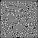
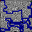

# LabyrinthSolver

Programma che data in input un'immagine di un labirinto nella cartella di input trova il percorso tra l'inizio e la fine colorandolo e crendo un'immagine nella cartella output.\
Le caselle, i muri, l'inizio, la fine e il percorso sono codificate con dei colori specifici nell'immagine di input e possono essere cambiati modificando il dizionario.
 ### Colori predefiniti

 |Casella      |Colore RGB   |
 |-------------|:-----------:|
 |Casella vuota|(255,255,255)|
 |Muro         |(0,0,0)      |
 |Inizio       |(255,0,0)    |
 |Fine         |(0,255,0)    |
 |Percorso     |(0,0,255)    |

### Esempio
 Input:\
 \
 Output:\
 